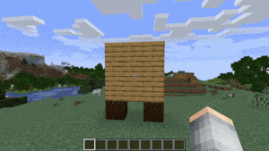
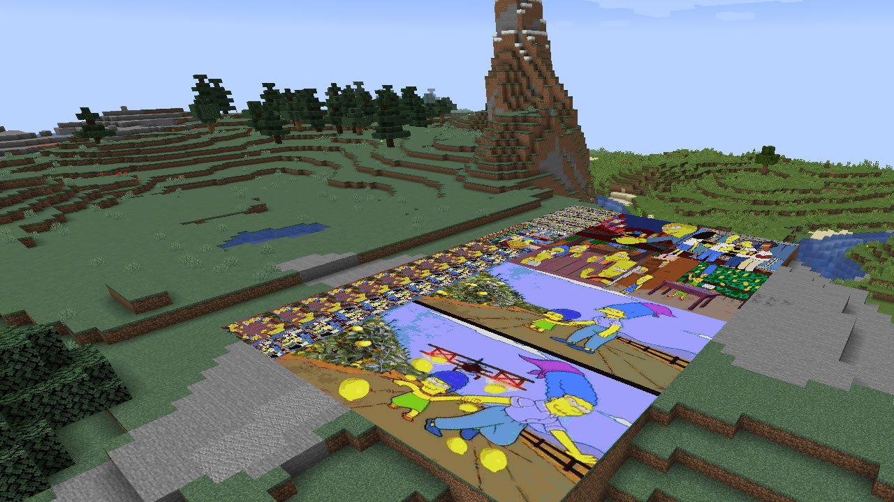
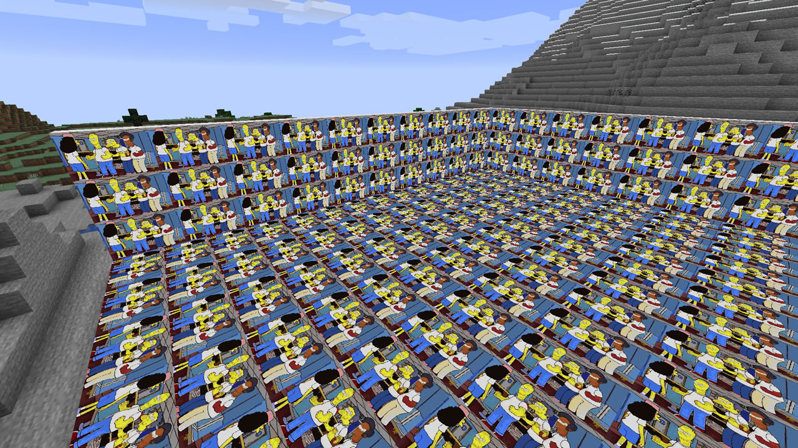

# Yet Another Minecraft Image Placing Addon
[](https://github.com/josemmo/yamipa/actions)
[](https://github.com/josemmo/yamipa/releases/latest)

[](https://bstats.org/plugin/bukkit/Yamipa/10243)
[](LICENSE)

Yamipa is an Spigot plugin that allows you to place images on any surface in your Minecraft server.
It is designed with performance and compatibility in mind, so even the most low-specs servers should be able to run it.

<p align="center">
    <a href="https://i.imgur.com/9rzeKFS.mp4"></a>
    <a href="screenshots/sample-1.jpg"></a>
    <a href="screenshots/sample-2.jpg"></a>
</p>

## Installation
Download the JAR file for the [latest release](https://github.com/josemmo/yamipa/releases/latest) and copy it to the
"plugins" directory of your Minecraft server as you'll do with any other plugin. That's it!

### Requirements
Before installing Yamipa make sure you meet the following requirements:

- CraftBukkit, Spigot or PaperMC v1.16 or v1.17
- [ProtocolLib](https://www.spigotmc.org/resources/protocollib.1997/) v4.6.1 or higher

## Configuration
Yamipa is ready-to-go right out of the box. By default, it creates the following files and directories under the
`plugins/YamipaPlugin` directory:

- `cache`: A directory containing cached images to speed up the rendering process. You shouldn't modify its contents.
- `images`: **This is the directory where you put the image files** you want to place in your Minecraft world.
- `images.dat`: A file holding the list and properties (e.g. coordinates) of all placed images in your server. You
shouldn't modify its contents.

You can change the default path of these files by creating a `config.yml` file in the plugin configuration directory:
```yaml
verbose: false         # Set to "true" to enable more verbose logging
animate-images: true   # Set to "false" to disable GIF support
images-path: images    # Path to images directory
cache-path: cache      # Path to cache directory
data-path: images.dat  # Path to placed images database file
```

This library uses bStats to anonymously report the number of installs. If you don't like this, feel free to
disable it at any time by adding `enabled: false` to the
[bStats configuration file](https://bstats.org/getting-started#:~:text=Disabling%20bStats) (it's ok, no hard feelings).

## Usage
This plugin adds the following commands:

- `/image clear <x z world> <r> [<placed-by>]`: Remove all placed images in a radius of `r` blocks around an origin.
- `/image describe`: Show detailed information about a placed image.
- `/image download <url> <filename>`: Download an image from a URL and place it in the images directory.
- `/image list [<page>]`: List all available files in the images directory.
- `/image place <filename> <width> [<height>]`: Place an image of size `width`x`height` blocks.
- `/image remove`: Remove a placed image from the world without deleting the image file.
- `/image top`: List players with the most placed images.

### Examples

- Show help\
  `/image`
- Download an image from a URL and save it with another name\
  `/image download "https://www.example.com/a/b/c/1234.jpg" imagename.jpg`
- Start the dialog to place an image with a width of 3 blocks and auto height\
  `/image place imagename.jpg 3`
- Start the dialog to place a 3-blocks wide and 2-blocks high image\
  `/image place imagename.jpg 3 2`
- Start the dialog to remove a placed image while keeping the original file\
  `/image remove`
- Remove all placed images in a radius of 5 blocks around the spawn\
  `/image clear 0 0 world 5`
- Remove all images placed by "EvilPlayer" in a radius of 100 blocks in the nether\
  `/image clear 50 70 world_nether 100 EvilPlayer`
- Remove all legacy placed images (without "placed by" metadata)\
  `/image clear 0 0 world 9999999 00000000-0000-0000-0000-000000000000`

## Permissions
If you want more granular control over the players who can use a particular set of commands, permissions are the way to go!

Yamipa defines the following permissions, each one corresponding to the command with the same name:

- `yamipa.clear`
- `yamipa.describe`
- `yamipa.download`
- `yamipa.list`
- `yamipa.place`
- `yamipa.remove`
- `yamipa.top`

By default, only server OPs have all permissions granted. You can change this by using a permission plugin,
such as [LuckPerms](https://luckperms.net/) or [GroupManager](https://elgarl.github.io/GroupManager/).

Both these plugins have been tested to work with Yamipa, although any similar one should work just fine.

## License
Yamipa is licensed under the [MIT License](LICENSE).
