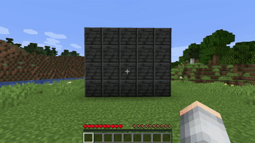
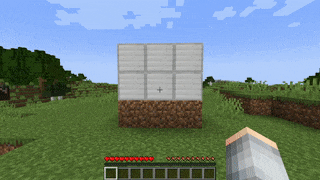

# Yet Another Minecraft Image Placing Addon
[](https://github.com/josemmo/yamipa/actions)
[](https://github.com/josemmo/yamipa/releases/latest)

[](https://bstats.org/plugin/bukkit/Yamipa/10243)
[](LICENSE)

Yamipa is a Spigot plugin that allows players to place images (even **animated**!) on any surface in your Minecraft server
without having to install any local client mod.

It is designed with performance and compatibility in mind, so even the most low-specs servers should be able to run it.

<p align="center">
    <a href="https://imgur.com/9rzeKFS"></a>
    <a href="https://imgur.com/a/J22z9Dq"></a>
    <a href="https://imgur.com/a/laPF1eN"></a>
    <a href="screenshots/sample.jpg"></a>
</p>

## Installation
Download the JAR file for the [latest release](https://github.com/josemmo/yamipa/releases/latest) and copy it to the
"plugins" directory of your Minecraft server as you'll do with any other plugin. That's it!

### Requirements
Before installing Yamipa make sure you meet the following requirements:

- CraftBukkit, Spigot or PaperMC 1.16 or higher
- [ProtocolLib](https://www.spigotmc.org/resources/protocollib.1997/) v4.8.0 or higher
  (latest [dev build](https://ci.dmulloy2.net/job/ProtocolLib/lastSuccessfulBuild/) for 1.19.4)

Here are the Minecraft distributions where Yamipa should be able to run:
| Minecraft version | CraftBukkit | Spigot | PaperMC |
|------------------:|:-----------:|:------:|:-------:|
|            1.16.x |     ✅      |   ✅    |   ✅    |
|     1.17 & 1.17.1 |     ✅      |   ✅    |   ✅    |
|     1.18 & 1.18.x |     ✅      |   ✅    |   ✅    |
|     1.19 & 1.19.x |     ✅      |   ✅    |   ✅    |

## Configuration
Yamipa is ready-to-go right out of the box. By default, it creates the following files and directories under the
`plugins/YamipaPlugin` directory:

- `cache`: A directory containing cached images to speed up the rendering process. You shouldn't modify its contents.
- `images`: **This is the directory where you put the image files** you want to place in your Minecraft world.
- `images.dat`: A file holding the list and properties (e.g. coordinates) of all placed images in your server. You
shouldn't modify its contents.

You can change the default path of these files by creating a `config.yml` file in the plugin configuration directory:
```yaml
verbose: false         # Set to "true" to enable more verbose logging
animate-images: true   # Set to "false" to disable GIF support
images-path: images    # Path to images directory
cache-path: cache      # Path to cache directory
data-path: images.dat  # Path to placed images database file
```

This library uses bStats to anonymously report the number of installs. If you don't like this, feel free to
disable it at any time by adding `enabled: false` to the
[bStats configuration file](https://bstats.org/getting-started#:~:text=Disabling%20bStats) (it's ok, no hard feelings).

## Usage
This plugin adds the following commands:

- `/image clear <x z world> <r> [<placed-by>]`: Remove all placed images in a radius of `r` blocks around an origin.
- `/image describe`: Show detailed information about a placed image.
- `/image download <url> <filename>`: Download an image from a URL and place it in the images directory.
- `/image give <player> <filename> <amount> <w> [<h>] [<flags>]`: Give image items that can be placed later to a player.
- `/image list [<page>]`: List all available files in the images directory.
- `/image place <filename> <w> [<h>] [<flags>]`: Place an image of size `w`x`h` blocks.
- `/image remove`: Remove a placed image from the world without deleting the image file.
- `/image top`: List players with the most placed images.

### Examples

- Show help\
  `/image`
- Download an image from a URL and save it with another name\
  `/image download "https://www.example.com/a/b/c/1234.jpg" imagename.jpg`
- Give 10 image items to "TestPlayer" for the "test.jpg" image (3x5 blocks)\
  `/image give TestPlayer test.jpg 10 3 5`
- Give 10 image items to "TestPlayer" that will not drop an image item when removed\
  `/image give TestPlayer test.jpg 10 3 5 -DROP`
- Start the dialog to place an image with a width of 3 blocks and auto height\
  `/image place imagename.jpg 3`
- Start the dialog to place a 3-blocks wide and 2-blocks high image\
  `/image place imagename.jpg 3 2`
- Start the dialog to place an image that glows in the dark\
  `/image place imagename.jpg 3 2 +GLOW`
- Start the dialog to remove a placed image while keeping the original file\
  `/image remove`
- Remove all placed images in a radius of 5 blocks around the spawn\
  `/image clear 0 0 world 5`
- Remove all images placed by "EvilPlayer" in a radius of 100 blocks in the nether\
  `/image clear 50 70 world_nether 100 EvilPlayer`
- Remove all legacy placed images (without "placed by" metadata)\
  `/image clear 0 0 world 9999999 00000000-0000-0000-0000-000000000000`

## Permissions
If you want more granular control over the players who can use a particular set of commands, permissions are the way to go!

Yamipa defines the following permissions:

| Command                     |   Default   | Description                                                     |
|:----------------------------|:-----------:|:----------------------------------------------------------------|
| `yamipa.command.clear`      |     OPs     | To use the `/image clear` command                               |
| `yamipa.command.describe`   |     OPs     | To use the `/image describe` command                            |
| `yamipa.command.download`   |     OPs     | To use the `/image download` command                            |
| `yamipa.command.give`       |     OPs     | To use the `/image give` download                               |
| `yamipa.command.list`       |     OPs     | To use the `/image list` command                                |
| `yamipa.command.place`      |     OPs     | To use the `/image place` command                               |
| `yamipa.command.remove`     |     OPs     | To use the `/image remove` command                              |
| `yamipa.command.remove.own` |     OPs     | Same as previous, but only for images placed by the same player |
| `yamipa.command.top`        |     OPs     | To use the `/image top` command                                 |
| `yamipa.item.place`         | All players | To place image items                                            |
| `yamipa.item.remove`        | All players | To remove image items (that have the `REMO` flag)               |
| `yamipa.item.remove.own`    | All players | Same as previous, but only for images placed by the same player |

Note that permissions work **as a tree**. This means that if you grant a permission, by default its children will also
be granted. For instance, you can grant access to all commands with `yamipa.command.*`.
Similarly, if you grant the `yamipa.command.remove`, the permission `yamipa.command.remove.own` will also be granted.

You can change which roles or players are granted these commands by using a permission plugin,
such as [LuckPerms](https://luckperms.net/) or [GroupManager](https://elgarl.github.io/GroupManager/).
Both these plugins have been tested to work with Yamipa, although any similar one should work just fine.

## Protecting areas
In large servers, letting your players place and remove images wherever they want might not be the most sensible idea.
For those cases, Yamipa is compatible with other Bukkit plugins that allow creating and managing world areas.
If you have one or more of such plugins, Yamipa will automatically apply permissions accordingly and only let players
place or remove images where they can place or remove blocks, no additional configuration required.

The supported plugins are:

- [WorldGuard](https://enginehub.org/worldguard/)
- [GriefPrevention](https://www.spigotmc.org/resources/griefprevention.1884/)
- [Towny Advanced](https://townyadvanced.github.io/)

## Flags
Images from this plugin have a set of boolean attributes called "flags" that modify its behavior. Possible values are:

- `ANIM` (animatable): Whether an image should be animated or not, useful when you don't want a GIF image to play.
- `REMO` (removable): Whether an image can be removed by any player by left-clicking it.
- `DROP` (droppable): Whether an image drops an image item when is removed by any player.
- `GLOW` (glowing): Whether an image glows in the dark (only works on Minecraft 1.17 and above).

By default, images placed with the "/image place" command only have the `ANIM` flag.
Similarly, image items issued with the "/image give" command have `ANIM`, `REMO` and `DROP` flags.

Default flags can be modified through the "flags" argument.
To add a flag to the default ones use "+{FLAG_NAME}" (e.g. `+GLOW`), and to remove it use "-{FLAG_NAME}" (e.g. `-ANIM`).
You can modify multiple flags separating them with commas (e.g. `+GLOW,-ANIM`).

## How does it work?
As you may have already guessed, Minecraft does not support the placing of image files.
Yamipa bypasses this limitation by using two built-in features (**item frames and maps**) to render custom images.

However, because item frames **are entities** (and these cause a lot of lag in a server), Yamipa **does not actually
create any entity** in your world. Instead, it tricks your players' clients into thinking there's a placed item frame
where there isn't by sending crafted network packets.

In the case of animated images (i.e. GIFs), Yamipa sends all animation frames to the player (which takes a decent amount
of bandwidth) and then sends a tiny packet telling the client to switch to the next animation step (i.e. map) every few
milliseconds.

> **IMPORTANT!**\
> Because Yamipa stores a cached copy of an image in memory whenever a player is near it just in case it needs to send
> it again without compromising performance, your server **needs to have a bit of spare RAM** to handle this.
>
> The rule of thumb here is 100K per unique loaded image (1MB for animated images).
> Unique means if the same image with same dimensions is placed multiple times it only counts as one instance.

## License
Yamipa is licensed under the [MIT License](LICENSE).
